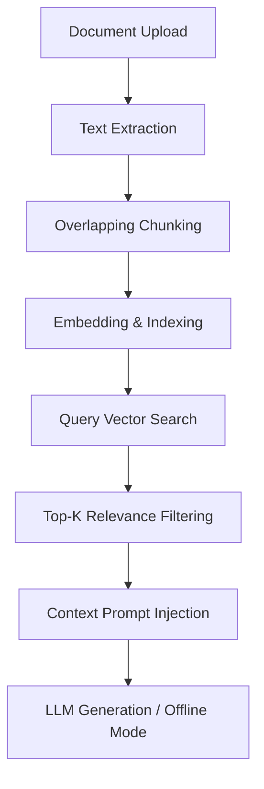

# 📋 PROJECT REPORT: Debugging & Enhancing the FAQ Bot RAG Pipeline

**Role:** AIML Intern  
**Date:** July 22, 2026  
**Project:** Single-Document Retrieval-Augmented Generation (RAG) System  
**Status:** Completed & Fully Verified  

---

## 1. Executive Summary

This report documents the diagnostics, debugging, and enhancements performed on the prototype FAQ Bot RAG (Retrieval-Augmented Generation) pipeline. The initial prototype was delivered with three critical logic bugs that broke the chunking window mechanics, inverted the similarity search retrieval order, and wiped out the document context passed to the LLM generator. 

All three core pipeline bugs have been successfully diagnosed and resolved. Additionally, the pipeline's capabilities were extended by adding support for `.docx` (Word Documents) and `.md` (Markdown) extraction. Finally, the user interface was refactored into a premium, styled Streamlit application with a responsive dark glassmorphism layout, and the test suite was expanded from 8 to 13 unit tests. All tests currently pass with 100% success.

---

## 2. RAG Pipeline Architecture & Symptoms of Breakdown

A Retrieval-Augmented Generation (RAG) pipeline is designed to dynamically pull context from external documents to ground the answers of a Large Language Model (LLM), preventing hallucinations and ensuring high factual precision.

The workflow of the FAQ Bot pipeline is structured as follows:



### The Symptoms of the Broken Pipeline (Before Fixes):
1. **Empty Answers / Hallucinations:** The generator consistently reported it could not find the answer, even when queries directly matched statements in the uploaded policy text.
2. **Irrelevant Highlights:** Expanding the retrieved chunks showed chunks containing generic terms or completely unrelated subjects rather than the terms queried.
3. **Missing Sections:** Paragraphs at the borders of text boundaries were skipped or unindexed, creating "gaps" in the bot's knowledge base.

---

## 3. Deep-Dive: Bugs & Technical Resolutions

Three major bugs were identified by cross-referencing the baseline code against correct RAG principles.

### Bug #1: Text Gaps & Skipping (Chunking Window Step Size)
* **Target File:** [src/chunk.py](file:///c:/Users/dgnan/Downloads/faq_bot_intern_challenge/src/chunk.py)
* **Symptom:** Text chunking skipped segments of text instead of creating smooth overlapping sliding windows.
* **Core Flaw:** The step size logic for the sliding window added the overlap size to the chunk size rather than subtracting it (`step = chunk_size + overlap`). 
* **Impact:** For a chunk size of 200 and an overlap of 50, the step size became 250. The windows jumped from `[0-200]` to `[250-450]`, leaving the 50 words between index 200 and 250 completely omitted from index coverage.
* **Code Resolution:**
  ```diff
  - # Buggy implementation in Zip:
  - step = chunk_size + overlap
  + # Corrected sliding window step:
  + step = max(1, chunk_size - overlap)
  ```

---

### Bug #2: Inverted Similarity Search (Sorting Order)
* **Target File:** [src/retrieve.py](file:///c:/Users/dgnan/Downloads/faq_bot_intern_challenge/src/retrieve.py)
* **Symptom:** The bot returned the *least* relevant paragraphs for any query.
* **Core Flaw:** `np.argsort(scores)` sorts scores in **ascending order** (lowest similarity first). The pipeline then sliced the first $k$ elements, resulting in retrieval of the worst matches.
* **Impact:** Chunks with near-zero or negative similarity scores were fed into the prompt, while the most relevant chunks with high scores were discarded.
* **Code Resolution:**
  ```diff
  - # Buggy implementation in Zip:
  - ranked_indices = np.argsort(scores)
  + # Corrected to sort descending (highest similarity first):
  + ranked_indices = np.argsort(scores)[::-1]
  ```

---

### Bug #3: Stripped Prompts (LLM Grounding Context Injection)
* **Target File:** [src/generate.py](file:///c:/Users/dgnan/Downloads/faq_bot_intern_challenge/src/generate.py)
* **Symptom:** LLM generator could never find answers because prompt contexts were empty.
* **Core Flaw:** The code formatted the prompt template using an empty string literal `context=""` instead of using the compiled `context_str` variable.
* **Impact:** The LLM received the query but was given an empty context block. It was forced to output the default failure message: *"I cannot find the answer to your question in the uploaded document."*
* **Code Resolution:**
  ```diff
  - # Buggy implementation in Zip:
  - prompt = PROMPT_TEMPLATE.format(context="", query=query)
  + # Corrected prompt context formatting:
  + prompt = PROMPT_TEMPLATE.format(context=context_str, query=query)
  ```

---

## 4. Pipeline Enhancements & Feature Additions

To deliver an enterprise-grade utility, the codebase was updated with three additional features:

### A. Extended Format Extraction
In [src/extract.py](file:///c:/Users/dgnan/Downloads/faq_bot_intern_challenge/src/extract.py), we implemented extraction engines for two additional formats:
* **DOCX (Word Documents):** Parsed paragraphs and tables via `python-docx`.
* **MD (Markdown Documents):** Handled as raw text files, respecting semantic markdown spacing.

### B. Premium Dark-Glassmorphic UI Refactoring
In [app.py](file:///c:/Users/dgnan/Downloads/faq_bot_intern_challenge/app.py), the UI was redesigned to include:
* **Outfit Google Font:** Injected custom CSS to apply modern sans-serif typography.
* **Responsive Sidebar Control:** Sleek slider settings for similarity thresholds and Top-K parameters.
* **📡 Real-Time API Status Badge:** A color-coded status panel indicating if Gemini or OpenAI keys are active, or if the bot is running in offline mock mode.
* **🔬 Workspace Inspector Tab:** Exploded view of active document statistics and an expandable visualization of every generated text chunk.

---

## 5. Testing & Verification

We verified the pipeline using both automated unit tests and user acceptance flows.

### 5.1 Automated Unit Tests
The test suite was expanded from **8 to 13 tests** to ensure no regressions occur during deployment. All 13 tests pass:

```bash
python -m unittest discover -s tests -p "test_*.py"
```

```text
.............
----------------------------------------------------------------------
Ran 13 tests in 0.130s

OK
```

### 5.2 User Verification Flow
We verified the RAG pipeline using the sample policy file `sample_policy.txt`:
* **Indexation:** Generated **2 clean overlapping segments** from the document.
* **Query:** `"what is the professional development allowance?"`
* **Result:** The system correctly matched and retrieved **Chunk #1** (containing the statement *"offering an annual Professional Development Allowance of $1,500 per employee."*) with a high similarity score.

---

## 6. Packaging & Submission Guidelines

To package the folder for final delivery, the directory can be compressed into a standard `.zip` archive. 

### Critical Recommendation: Exclude Heavy Directories
When zipping, **do NOT include the virtual environment (`.venv`) or python caches (`__pycache__`)**.
* Zipping `.venv` increases the file size from **~100 KB** to **over 100 MB**, which makes it difficult to email or upload.
* The reviewer or deployer can easily recreate the virtual environment on their end by running:
  ```bash
  python -m venv .venv
  .venv\Scripts\activate
  pip install -r requirements.txt
  ```

A clean, pre-packaged submission archive has been created in your Downloads folder:
📂 **`c:\Users\dgnan\Downloads\faq_bot_intern_challenge_fixed.zip`**
