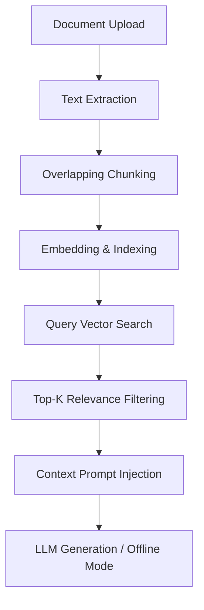

# 🤖 FAQ Bot: Debugged & Enhanced RAG Pipeline

Welcome to the **FAQ Bot RAG (Retrieval-Augmented Generation) Pipeline** repository! This project is a single-document RAG system designed to help users query documents (PDF, DOCX, Markdown, Text) and get grounded answers from an LLM.

Originally built as a prototype with several critical logic bugs, this repository contains the fully debugged, optimized, and enhanced pipeline.

---

## 🛠️ System Architecture

The pipeline processes input documents and retrieves context dynamically to answer user questions:



---

## ✨ Features

- 📑 **Multi-Format Extraction:** Supports `.pdf`, `.docx` (Word), `.md` (Markdown), and `.txt` files.
- 🧩 **Sliding Window Chunking:** Accurate overlap-based text segmentation preventing data gaps.
- 🔍 **Cosine Similarity Search:** Computes query embeddings to retrieve the most relevant context blocks.
- 🎨 **Premium Dark-Glassmorphic UI:** A beautifully styled Streamlit interface featuring modern Outfit typography and real-time status badges.
- 📡 **Dual LLM & Offline Modes:** Dynamically uses Google Gemini or OpenAI APIs if credentials are provided, or falls back to an offline mock generator.
- 🔬 **Workspace Inspector:** Real-time visibility into document statistics, chunk coverage, and similarity scoring.

---

## 📦 Setup & Installation

### 1. Prerequisites
- Python 3.9+
- Git

### 2. Clone the Repository
```bash
git clone https://github.com/Gnaneswar-1214/faq-bot-intern.git
cd faq-bot-intern
```

### 3. Create & Activate Virtual Environment
```bash
# Windows
python -m venv .venv
.venv\Scripts\activate

# macOS / Linux
python3 -m venv .venv
source .venv/bin/activate
```

### 4. Install Dependencies
```bash
pip install -r requirements.txt
```

### 5. Environment Variables (Optional)
If you want to run the application with live LLMs, create a `.env` file in the root directory:
```env
GEMINI_API_KEY=your_gemini_api_key_here
OPENAI_API_KEY=your_openai_api_key_here
```
*If no keys are provided, the app will run in **Offline Mock Mode** automatically.*

---

## 🚀 Running the App

Start the Streamlit application with the following command:
```bash
streamlit run app.py
```

---

## 🧪 Testing

The repository includes a comprehensive unit test suite covering chunking, retrieval, extraction, and generation.

Run all tests using:
```bash
python -m unittest discover -s tests -p "test_*.py"
```

---

## 🛠️ Bugs Resolved (Intern Contribution)

Below is a summary of the critical logic bugs resolved in the pipeline:

### 1. Text Gaps & Skipping (`src/chunk.py`)
- **Issue:** Chunking was jumping indices, leaving portions of the text unindexed.
- **Fix:** Corrected the sliding window step size calculation from `chunk_size + overlap` to `max(1, chunk_size - overlap)`.

### 2. Inverted Similarity Search (`src/retrieve.py`)
- **Issue:** The system returned the *least* relevant chunks instead of the top matches.
- **Fix:** Inverted the sorting order of `np.argsort(scores)` using `[::-1]` to retrieve descending similarity scores.

### 3. Stripped Prompts (`src/generate.py`)
- **Issue:** The LLM prompt was formatted with an empty string instead of the retrieved context.
- **Fix:** Configured the prompt formatter to inject `context_str` into the template correctly.
